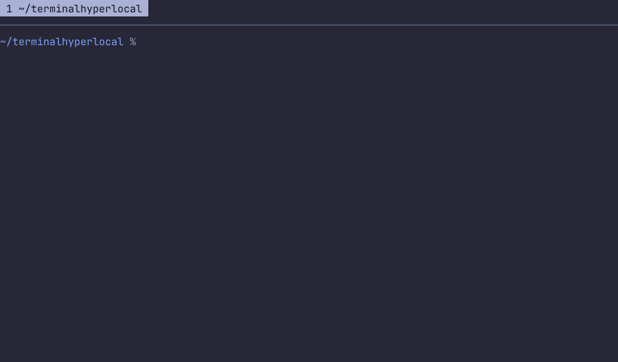

# thlmulti

Tabs for your terminal. Not tmux. Not zellij. ~1700 lines of Go.



Mac Alacritty does `Ctrl+T` — new tab, same window. Linux Alacritty does not.
Zellij does, but zellij is a whole world, and its mouse wheel stops scrolling
the moment you click. So: four features, nothing else.

1. **New tab, same window.** `Ctrl+T`. Starts in the folder you are standing in.
2. **Tab by number.** `Ctrl+1`..`Ctrl+9`, `Ctrl+0` for the tenth. Click tabs too.
   `Ctrl+Shift+W` closes one.
3. **Wheel always scrolls.** Click and scroll at once still scrolls. Drag over
   text, let go, it is in the clipboard. No mode, no prefix key.
4. **Paste key is yours.** `Ctrl+Alt+V` by default. Plain `Ctrl+V` is left alone,
   so vim's visual block still works.

No splits. No panes. No sessions. No detach. No plugins. No layout files.

## Needs

- Go 1.27+ to build, [go-task](https://taskfile.dev) for the Taskfile.
- A terminal that speaks the **Kitty keyboard protocol** (Alacritty 0.15+).
  Without it `Ctrl+<digit>` looks identical to a bare digit and tab switching
  cannot work. Everything else still does.
- A terminal that speaks **OSC 52**, for copy. Alacritty does.
- **`wl-paste` or `xclip`**, for paste. Terminals refuse to let a program read
  the clipboard, so we ask the system instead.

## Build

```sh
task build      # ./thlmulti
task install    # ~/.local/bin/thlmulti   (PREFIX=/usr/local task install)
task config     # ~/.config/thlmulti/config, keeps one that exists
task check      # gofmt, vet, test
task            # list everything
```

## Point Alacritty at it

Back up the file first, then run `task alacritty` and paste what it prints:

```toml
[terminal.shell]
program = "/home/you/.local/bin/thlmulti"
args = []
```

Alacritty starts thlmulti, thlmulti starts your shells. Shell flags like
`--login` go in the thlmulti config now, not in `alacritty.toml`. To undo it,
put your backup back.

## Config

`~/.config/thlmulti/config`. No file is fine — defaults apply. One
`name = value` per line, `#` is a comment. An unknown name is an error, so a
typo does not go quiet. `config.example` lists every setting.

### Keys

| Setting | Default | |
|---|---|---|
| `new_tab` | `ctrl+t` | open a tab |
| `close_tab` | `ctrl+shift+w` | close it |
| `paste` | `ctrl+alt+v` | paste the clipboard |
| `tab_mods` | `ctrl` | modifier for tab-by-number |

Chords look like `ctrl+alt+v`. Modifiers: `ctrl`, `alt`, `shift`, `super`. The
key is a single character. `none` switches a binding off.

Why the odd defaults:

- Not `ctrl+w` to close — that deletes a word in zsh, far too useful to steal.
- Not `ctrl+shift+v` to paste — Alacritty already owns it and pastes on its own,
  so the key would never reach us.
- Not `ctrl+v` to paste — that is vim's visual block.

`tab_mods` must carry a modifier. Without one, a bare `1` would switch tabs and
you could not type a digit, so it is refused.

### Shell

```
shell = /bin/zsh --login
```

First word is the program, the rest are flags. Defaults to `$SHELL`.

### Scrollback

```
scrollback = 2000
```

Lines of history per tab; `0` keeps none.

History is stored as whole rows at full width — 88 bytes a cell, trailing
blanks included — so a line costs `columns * 88` bytes whatever is printed on
it. That is 17 KB a line at 200 columns, and it is per tab. Nothing out here can
change it: it is the emulator's own data structure.

What can be changed is everything the history has already been. Pushing lines
through a history that is full allocates several times what it holds, and Go
hangs on to what it drops, ready for the next burst. thlmulti hands that back
once nothing has happened for five seconds — collecting a big heap costs tens of
milliseconds, so it waits for a moment when nobody is waiting on it. Measured on
one tab, 200 columns, 60000 lines pushed through it:

| `scrollback` | RSS during the flood | once it goes quiet | history alone |
|---|---|---|---|
| `0` | 15 MB | 12 MB | 0 MB |
| `2000` (default) | 105 MB | 62 MB | 34 MB |
| `20000` | 1013 MB | 397 MB | 336 MB |

`go test -run Reclaim -v .` prints that table on your machine.

The middle column is a peak, not a resting state, and the right-hand one is the
floor: history you asked to keep, and it is not going anywhere while you can
still scroll to it. A wider window pays more for the same line count — 20000
lines is 134 MB at 80 columns and 503 MB at 300.

Ten tabs at 20000 is still not a thing you can have. The emulator's own default
was 10000; this is 2000, same as tmux. Raise it if you need it — now you know
the price.

### Colours

thlmulti only paints the tab bar. The terminals inside the tabs paint
themselves.

```
theme = auto
```

`auto` asks the terminal whether it is dark or light and follows. A terminal
that will not answer gets the dark palette. One that changes theme while
running gets repainted. Write `dark` or `light` to stop it guessing.

Pin any part by hand; whatever you leave out follows the theme.

| Setting | |
|---|---|
| `tab_fg`, `tab_bg` | tabs not in front, separators, the rule |
| `active_fg`, `active_bg` | the tab in front |
| `toast_fg`, `toast_bg` | "Copied to clipboard" |
| `error_fg`, `error_bg` | something failed |

Values: `default`, a colour name (`black`…`white`, `bright-black`…
`bright-white`, which use *your* palette), an index `0`–`255`, or `#rrggbb`.

```
theme     = dark
active_bg = #1d2021
active_fg = bright-white
```

## Mouse

- Drag over text, let go — copied. No key needed.
- Wheel scrolls history. Inside a full-screen program it becomes arrow keys, so
  it scrolls the thing you are looking at.
- Click a tab to switch.
- Programs that ask for the mouse (vim, k9s) get it. Hold **Shift** to take it
  back for Alacritty's own selection.
- A drag that wanders up onto the tab bar still belongs to the terminal, so the
  release is not lost and the selection does not get stuck. That was a bug once;
  a test guards it now.

## Things worth knowing

**TERM.** Children get `xterm-kitty` only if that terminfo entry actually exists
on the machine, otherwise `xterm-256color`. A TERM with no terminfo behind it
makes zsh's line editor redraw blind — the prompt vanishes and every backspace
leaves a staircase of garbage.

**The scrollback hack.** vaxis hardcodes 10000 lines and exposes no knob, so
`scrollback.go` reaches in with `reflect` and sets the field. Ugly. The
alternative was carrying a 9000-line fork of the emulator for one integer. Every
field is checked by name and kind, so a vaxis upgrade that moves it reports an
error in the tab bar instead of silently doing nothing.

## Layout

```
main.go         tabs, key and mouse routing, the tab bar, the event loop
config.go       ~/.config/thlmulti/config
theme.go        tab bar colours, auto dark/light
scrollback.go   the history limit
clipboard.go    reading the clipboard (wl-paste, xclip)
cwd.go          the shell's folder, from /proc, for a new tab
terminfo.go     picking a TERM that has terminfo behind it
demo/           records docs/demo.gif; a module of its own, so a font
                rasteriser is not a dependency of the terminal
```

## Tests

`task test`. `resize_integration_test.go` builds the real binary, runs it under
a pty, grows the window and checks it repaints at the new width. That bug got
past the unit tests three times — keep the test.
