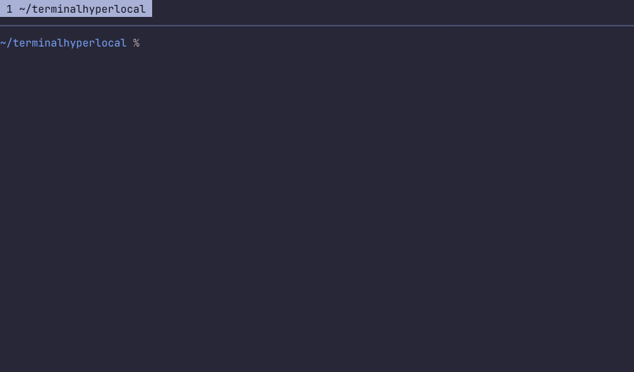

# thlmulti

Tabs for your terminal. Not tmux. Not zellij. ~2000 lines of Go.



Mac Alacritty does `Ctrl+T` — new tab, same window. Linux Alacritty does not.
Zellij does, but zellij is a whole world, and its mouse wheel stops scrolling
the moment you click. So: five features, nothing else.

1. **New tab, same window.** `Ctrl+T`. Starts in the folder you are standing in.
2. **Tab by number.** `Ctrl+1`..`Ctrl+9`, `Ctrl+0` for the tenth. `Ctrl+Tab` and
   `Ctrl+Shift+Tab` step along. Click tabs too. `Ctrl+Shift+W` closes one.
3. **Wheel always scrolls.** Click and scroll at once still scrolls. Drag over
   text, let go, it is in the clipboard. No mode, no prefix key.
4. **Paste key is yours.** `Ctrl+Alt+V` by default. Plain `Ctrl+V` is left alone,
   so vim's visual block still works.
5. **Tabs say what is going on in them.** A tab with a job running is marked
   `▶`. A tab behind you that printed something is marked `●`. A tab that rang
   its bell or sent a notification is marked `!`. `Ctrl+Shift+A` jumps to the
   one that wants you. Run six agents in six tabs and the bar tells you which
   one has finished, which one is asking, and which are still working.

No splits. No panes. No sessions. No detach. No plugins. No layout files.

And one rule underneath: **the window never freezes.** A tab whose program has
stopped reading its terminal, a clipboard tool that never answers, a tab
streaming a build log behind you — none of it can stall the bar, the mouse, or
the other tabs. See "Things worth knowing" for what that took.

## Needs

- Go 1.27+ to build, [go-task](https://taskfile.dev) for the Taskfile.
- A terminal that speaks the **Kitty keyboard protocol** (Alacritty 0.15+).
  Without it `Ctrl+<digit>` looks identical to a bare digit and tab switching
  cannot work. Everything else still does.
- A terminal that speaks **OSC 52**, for copy. Alacritty does.
- **`wl-paste` on Wayland, `xclip` on X11**, for paste. Terminals refuse to
  let a program read the clipboard, so we ask the system instead.

## Build

```sh
task build      # ./thlmulti, static
task install    # ~/.local/bin/thlmulti   (PREFIX=/usr/local task install)
task config     # ~/.config/thlmulti/config, keeps one that exists
task check      # gofmt, vet, test
task lint       # golangci-lint
task            # list everything
```

Or take a linux/amd64 build from
[Releases](https://github.com/haosb/thlmulti/releases). Pushing a `v*` tag
builds one with `task build` and publishes it with a checksum.

## Point Alacritty at it

Back up the file first, then run `task alacritty` and paste what it prints:

```toml
[terminal.shell]
program = "/home/you/.local/bin/thlmulti"
args = []
```

Alacritty starts thlmulti, thlmulti starts your shells. Shell flags like
`--login` go in the thlmulti config now, not in `alacritty.toml`. To undo it,
put your backup back.

## Config

`~/.config/thlmulti/config`. No file is fine — defaults apply. One
`name = value` per line, `#` is a comment. An unknown name is an error, so a
typo does not go quiet. `config.example` lists every setting.

### Keys

| Setting | Default | |
|---|---|---|
| `new_tab` | `ctrl+t` | open a tab |
| `close_tab` | `ctrl+shift+w` | close it; twice if a job is running in it |
| `paste` | `ctrl+alt+v` | paste the clipboard |
| `next_tab` | `ctrl+tab` | the tab to the right, wrapping |
| `prev_tab` | `ctrl+shift+tab` | the tab to the left, wrapping |
| `attention_tab` | `ctrl+shift+a` | the next tab marked `!`, else the next marked `●` |
| `move_left` | `ctrl+shift+pgup` | shift the tab in front one place left |
| `move_right` | `ctrl+shift+pgdown` | shift it one place right |
| `rename_tab` | `ctrl+shift+r` | name the tab in front; enter keeps it, escape does not |
| `tab_mods` | `ctrl` | modifier for tab-by-number |

Chords look like `ctrl+alt+v`. Modifiers: `ctrl`, `alt`, `shift`, `super`. The
key is a single character or a name: `tab`, `enter`, `esc`, `space`,
`backspace`, `up`, `down`, `left`, `right`, `pgup`, `pgdown`, `home`, `end`,
`insert`, `delete`, `f1`..`f12`. `none` switches a binding off.

Why the odd defaults:

- Not `ctrl+w` to close — that deletes a word in zsh, far too useful to steal.
- Not `ctrl+shift+v` to paste — Alacritty already owns it and pastes on its own,
  so the key would never reach us.
- Not `ctrl+v` to paste — that is vim's visual block.
- `ctrl+tab` is a key of its own only under the Kitty keyboard protocol. Without
  it the host sends a bare tab, the binding does not match, and completion in
  the shell still works.
- `ctrl+shift+pgup`/`pgdown` is how Firefox moves tabs. Alacritty's own
  scrolling is on `shift+pgup` without the ctrl, so these get through.

`tab_mods` must carry a modifier. Without one, a bare `1` would switch tabs and
you could not type a digit, so it is refused.

### Tabs that say what is going on

Each tab carries at most one mark, the most urgent of these:

| | Meaning | Cleared |
|---|---|---|
| `!` | the tab rang its bell or sent a notification (OSC 9 / 777) while you were not looking at it | when you look at it |
| `●` | output arrived while the tab was behind another | when you look at it |
| `▶` | a job is in the foreground: the shell has handed its terminal to a command | when the command exits |

The bell reaches the host terminal too, so whatever Alacritty is set to do
about a bell still happens, and a notification's text shows in the bar for a
few seconds with the tab's number in front of it. Claude Code with
`preferredNotifChannel` set to `terminal_bell` rings when it needs you; other
agents send OSC 9. Either way the tab gets its `!`.

`▶` is read from `/proc/<shell>/stat` once a second, so it needs nothing from
the shell — no prompt hooks, no shell integration. It is what tells an agent
that is still working (`▶`) from one that has finished and returned to the
prompt (`●`, because the last of its output arrived behind your back).

Closing a tab marked `▶` asks for the key twice: hanging up on a shell at its
prompt loses nothing, hanging up on an agent halfway through a task loses the
task.

A tab's label is the name you gave it with `rename_tab`, else the title the
program set, else the shell's name. Naming matters once every tab is titled
"Claude Code".

### Shell

```
shell = /bin/zsh --login
```

First word is the program, the rest are flags. Defaults to `$SHELL`.

### Scrollback

```
scrollback = 2000
```

Lines of history per tab; `0` keeps none.

History is stored as whole rows at full width — 88 bytes a cell, trailing
blanks included — so a line costs `columns * 88` bytes whatever is printed on
it. That is 17 KB a line at 200 columns, and it is per tab. Nothing out here can
change it: it is the emulator's own data structure.

What can be changed is everything the history has already been. Pushing lines
through a history that is full allocates several times what it holds, and Go
hangs on to what it drops, ready for the next burst. thlmulti hands that back
once nothing has happened for five seconds — collecting a big heap costs tens of
milliseconds, so it waits for a moment when nobody is waiting on it. Measured on
one tab, 200 columns, 60000 lines pushed through it:

| `scrollback` | RSS during the flood | once it goes quiet | history alone |
|---|---|---|---|
| `0` | 15 MB | 12 MB | 0 MB |
| `2000` (default) | 105 MB | 62 MB | 34 MB |
| `20000` | 1013 MB | 397 MB | 336 MB |

`go test -run Reclaim -v .` prints that table on your machine.

The middle column is a peak, not a resting state, and the right-hand one is the
floor: history you asked to keep, and it is not going anywhere while you can
still scroll to it. A wider window pays more for the same line count — 20000
lines is 134 MB at 80 columns and 503 MB at 300.

Ten tabs at 20000 is still not a thing you can have. The emulator's own default
was 10000; this is 2000, same as tmux. Raise it if you need it — now you know
the price.

### Colours

thlmulti only paints the tab bar. The terminals inside the tabs paint
themselves.

```
theme = auto
```

`auto` asks the terminal whether it is dark or light and follows. A terminal
that will not answer gets the dark palette. One that changes theme while
running gets repainted. Write `dark` or `light` to stop it guessing.

Pin any part by hand; whatever you leave out follows the theme.

| Setting | |
|---|---|
| `tab_fg`, `tab_bg` | tabs not in front, separators, the rule |
| `active_fg`, `active_bg` | the tab in front |
| `toast_fg`, `toast_bg` | "Copied to clipboard", notifications, the rename prompt |
| `error_fg`, `error_bg` | something failed |
| `bell_fg` | the `!` mark |
| `unseen_fg` | the `●` mark |

Values: `default`, a colour name (`black`…`white`, `bright-black`…
`bright-white`, which use *your* palette), an index `0`–`255`, or `#rrggbb`.

```
theme     = dark
active_bg = #1d2021
active_fg = bright-white
```

## Mouse

- Drag over text, let go — copied. No key needed.
- Wheel scrolls history. Inside a full-screen program it becomes arrow keys, so
  it scrolls the thing you are looking at.
- Click a tab to switch.
- Programs that ask for the mouse (vim, k9s) get it. Hold **Shift** to take it
  back for Alacritty's own selection.
- A drag that wanders up onto the tab bar still belongs to the terminal, so the
  release is not lost and the selection does not get stuck. That was a bug once;
  a test guards it now.

## Things worth knowing

**Nothing waits on the event loop.** The loop routes events and paints
frames, and that is all it does. Three things used to make it wait, and each
one froze the whole window:

- *Writing to a pty.* The kernel buffers about 4 KB of input for a program
  that is not reading its terminal. Paste more than that into a build, a
  sleep, anything busy, and the write blocks until the program reads — which
  may be never. Every tab now has a goroutine of its own (`pump.go`) that does
  the writing, so a stuck tab is stuck alone. `hang_integration_test.go` pastes
  35 KB into a `sleep` and opens a new tab while it is stuck.
- *Reading the clipboard.* `wl-paste` waits on whoever owns the clipboard, and
  an owner that has hung waits forever. It runs off the loop now, with a
  three-second limit.
- *Posting to a full queue.* The emulator's events used to be dropped when the
  loop fell behind, and a dropped redraw left a tab showing stale output until
  the next keystroke. They block instead now, which pauses that tab's reader
  until the loop catches up — the right thing, since the loop no longer
  blocks on anything itself.

**The cursor.** Two bugs made it hard to see what you were typing, and both
are gone. Vaxis keeps the cursor where the last frame left it unless told
otherwise, so when a program hid its cursor — a full-screen UI drawing a
frame, a shell mid-redraw — the host cursor stayed on, sitting on a cell the
program had moved on from. Every frame now starts with the cursor hidden and
the terminal puts it back if it has one to show. And closing the tab in
front left its neighbour blurred: it had been told to lose focus when it went
behind, and nothing told it otherwise, so its cursor stayed hidden and it
never reported focus to its child. `TestClosingTheActiveTabFocusesItsNeighbour`
guards that.

**TERM.** Children get `xterm-kitty` only if that terminfo entry actually exists
on the machine, otherwise `xterm-256color`. A TERM with no terminfo behind it
makes zsh's line editor redraw blind — the prompt vanishes and every backspace
leaves a staircase of garbage.

**The scrollback hack.** vaxis hardcodes 10000 lines and exposes no knob, so
`scrollback.go` reaches in with `reflect` and sets the field, under the
emulator's own mutex, reached the same way. Ugly. The alternative was carrying
a 9000-line fork of the emulator for one integer. Every field is checked by
name and kind, so a vaxis upgrade that moves it reports an error in the tab bar
instead of silently doing nothing. The limit is put back after a resize and
once a second, because a full reset from the child (`reset`, `tput reset`)
rebuilds the buffer at the library's default.

## Layout

```
cmd/thlmulti/        main(), and the two tests that run the real binary
internal/app/        the event loop and everything it owns
  app.go             the loop and what each event does
  tab.go             a tab: open, close, select, move, its marks, its events
  pump.go            the per-tab goroutine that feeds the emulator, so a
                     stuck child cannot stall the window
  keys.go            key routing, renaming, paste
  mouse.go           mouse routing
  bar.go             drawing the tab bar
  memory.go          handing the history's churn back to the OS when idle
internal/config/     ~/.config/thlmulti/config, and the tab bar colours
internal/scrollback/ the history limit
internal/clipboard/  reading the clipboard (wl-paste, xclip), with a time limit
internal/proc/       what /proc knows about a shell: its folder, whether a
                     job holds its terminal
internal/terminfo/   picking a TERM that has terminfo behind it
demo/                records docs/demo.gif; a module of its own, so a font
                     rasteriser is not a dependency of the terminal
```

## Tests

`task test`. Two tests in `cmd/thlmulti` build the real binary and run it
under a pty. `resize_integration_test.go` grows the window and checks it
repaints at the new width; that bug got past the unit tests three times.
`hang_integration_test.go` pastes into a program that is not reading and
checks the window still answers; that one froze the window for as long as the
program slept. Keep both. `go test -short` skips them.
